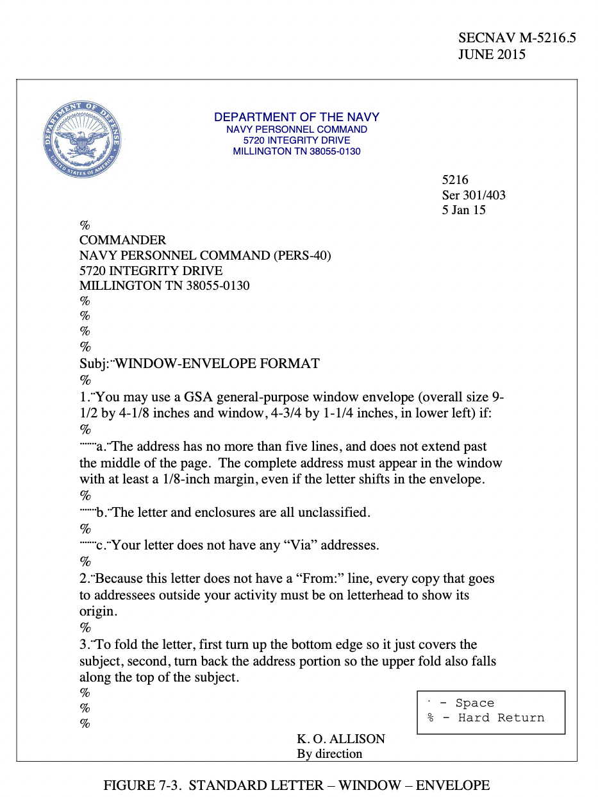

# Naval Letter Generator

## Intro

I discovered the [Naval Letter Generator](https://marines.dev/projects/#naval-letter-format-generator-application) project on the [Marine Coders](https://marines.dev/) website that could be enhanced. The original form is here
[Naval Letter Form](https://marines.dev/_pages/naval_letter_js_test.html)

Purpose of the letter is to reduce the time and effort to create a naval letter via web application and produce a correclty formatted word docx. Use the standard letter format or one of its variations to correspond officially within or
outside the DoD.

## Table of Contents
- [Naval Letter Types](#naval-letter-types)
- [Sprints](#sprints)
- [State Management](#state-management)
- [Dependencies](#dependencies)
- [Features](#features)
- [Icebox Goals](#icebox-goals)
- [Challenges](#challenges)
- Form's Component Structure
  - [Input Fields](#input-fields)
  - [Reply Block](#reply-block)
  - [Radio Buttons](#radio-buttons)
  - [Body Block](#body-block)
  - [Closing Block](#closing-block)
  - [Submitting The Form](#submitting-the-form)
- [Manual Testing](#manual-testing)
- [Naval Letter Format Examples](#naval-letter-format-examples-referencing-the-naval-letter-secnav-m-52165-june-2015) 
- [Acronyms](#acronyms)
- [Links](#links)

## How To Use The Application
- Select the the letter type from `dropdown`
- Fill out the form 
- Click the  **Generate Naval Letter** `button`
- *** No information is stored locally or to a database

## Naval Letter Types

- Standard
- Memorandom
- Business Letter
- Executive Correspondence

## Sprints

- ~~Skeleton the React app, configure TailwindUI, point git to github repo~~
- ~~Build out the basic components (input fields, buttons, etc..)~~
- ~~Bring all the components together and styles~~
- ~~Once UI finished, Work through the UX (Dynamic Radio buttons etc)~~
- ~~Migrated all component level state to App.js~~
- Submit App level state values into a form or into a word docx
- Validate from fields
- Handle the letter editing with js
- Deploy Github/Vercel

## State Management

- Initially built out each parent component with handling it's own state

- After confirming all of the parent components are handling state correctly, I will move all of the state to the App.js top level.
- The all form values are controlled components
- Permitting all the state can be handled at the top level in App.js and prop drilling does not present an opportunity for the Context API or Redux.

## Dependencies
- react-router-dom
- TailwindUI
- daisyUI
- file-saver
- docx

## Features

- Tool tips for clarity
- FAQ page
- Letter Type dropdown
- Reset button
- Add paragraphs and sub paragraphs
- Delete paragraphs and sub paragraphs
- Edit in realtime
- Produce a Naval Lettter in correct format with content added by user

## Icebox Goals

- Letter Types drop down menu for four variations of letter types
- Text editor/Autocomplete (Think Grammarly)

## Challenges

- Several state variables with nested array objects
- Unreliable deps for converting to word document

## Form Component Structure
## Input Fields
- **<span style="color:green">File Name</span>**
    - Maximum characters 85
    - Required
    - Validation for AlphaNumeric
- **<span style="color:green">SSIC</span>**
    - Maximum characters 5
    - Required
    - Validation for Numeric
- **<span style="color:green">Originator Code</span>**
    - Maximum characters 47
    - Required, a serial number is required with classified status
    - No Validation
- **<span style="color:green">Date</span>**
    - Maximum characters 18
    - Required
    <!-- TODO STOP USER FROM CREATING A DATE IN PAST -->
    - Validation
  
- **<span style="color:green">Unit Name</span>**
    - Maximum characters 85
    - Required
    - No Validation
- **<span style="color:green">Address</span>**
    - Maximum characters 85
    - Required
    - No Validation

## Reply Block
- **<span style="color:green">From</span>**
  - Maximum characters 85
  - Required
  - No Validation
  
- **<span style="color:green">To</span>** 
  - Maximum characters 85
  - Required
  - No Validation
- **<span style="color:green">Subject</span>**
  - Maximum characters 85
  - Required
  - No Validation
  - Built in function to make all caps

## Radio Buttons
**Optional items**
- **<span style="color:green">VIA</span>**
  - Maximum 10
  - Not required
  - No Validation
- **<span style="color:green">References</span>**
  - Maximum 50
  - Not required
  - No Validation
- **<span style="color:green">Enclosures</span>**
  - Maximum 50
  - Not required
  - No Validation

## Body Block
- **<span style="color:green">Paragraphs</span>**
  - Maximum 10 paragraphs
  - Required, sub paragraphs not required
  - No Validation
  - Each paragraph item consist of `pId`, `paragraph`, and can have a a total of three sub paragraphs added `subA`,`subB`,`subC` to one parent paragraph
  - The first prargraph will always remain available with delete functionality for the content but the UI will remain an empty paragragh text box
  - To delete a paragraph click delete on any paragraph except the first one
  - To delete a sub paragraph it must be deleted in reverse order it was added
  
- **<span style="color:green">Sub Paragraphs</span>**
  - Maximum 3 sub paragraphs per paragraph
  - Not Required
  - No Validation

## Closing Block
- **<span style="color:green">Signature/Title</span>**
  - Maximum 50
  - Required (title not required in some cases)
  - No Validation
- **<span style="color:green">Copy To</span>**
  - Maximum characters 85
  - Not Required
  - No Validation

## Submitting The Form

Once the **Generate Naval Letter** `button` is clicked the form is submitted and the `StandardLetterDocument.js` function will supply the state values via passed props to create the formatted letter as a `new Document`. The `Packer` will utilize the `toBlob` method and return a promise and save as as **StandardNavalLetter.docx** file for download.


## Manual Testing

**Paragraph Test**

**Create**

- Create a paragraph
- Create 2 paragraphs
- Create 1 paragraph with 3 sub paragraphs
- Create 1 paragraph with 3 sub paragraphs and a 2nd paragraph
- Create 1 paragraph and a 2nd paragraph with 3 sub paragraphs
- Create 1 paragraph with 3 sub paragraphs and a 2nd paragraph with 3 sub paragraphs

**Delete**

- Delete a paragraph
- Delete 2 paragraphs
- Delete sub paragraphs in reverse order of created order in 1 paragraph
- Delete sub paragraphs in reverse order of created order in 2nd paragraph, and 1st paragraph exists
- Delete the whole paragraph item including it's sub paragraphs
- Delete paragraphs out of order

**Edit**

Live edit on all paragraphs and sub paragraphs

**Input Field Test**

**Radio Button Test**

**Mobile test**

**Word Doc Test**

-------------------


## Naval Letter Format Examples (Referencing the Naval Letter SECNAV M-5216.5 June 2015)

To better help what each line should appear and an example use case to delinieate any validation or required fields

- **SSIC**

  - Notes:
    - An SSIC is a four- or five-digit number which represent a document’s subject. They are used to categorize information by subject and are required on all Navy and Marine Corps messages, directives, forms, and reports. To find the SSIC that most closely represents the subject, refer to SECNAV M-5210.2.
  - Example:

  ```
   5216
  ```

- **Originator’s Code**

  - Notes:
    - Originator’s Code, By Itself or in a Serial Number. The originator’s code, with or without the serial number, is the originator's office symbol or the hull number of a ship. Each command or activity will determine makeup of the originator’s code.
    - If a correspondence is classified a serial number is required see example
  - Example:

  ```
  Code 13
  ```

  - Example of SSIC, Originators Code and Serial # :
  ```
  5216 
  Ser Code 13/271
  ```


- **Date**

  - Notes:
    - Date a letter on the same day it is signed. Do not type the date when preparing correspondence that will be signed on a later date. Use the abbreviated date format discussed in chapter 2, page 2-11
  - Example SSIC, Originators Code, Serial and Date:
  ```
  5216
  Ser Code 13/271
  7 Sep 06
  ```

- **From**

  - Notes:  
    - The “From:” line is composed of the activity head’s title and the activity’s name. Avoid multiple titles
    - Refer to the three publications listed below for the correct names and mailing addresses for DON and DoD activities.
       - 1. SNDL
       - 2. Active Marine Link, Personal and Family Link, Military Personnel Services Link,  Postal Link under reference.
       - 3. DoDAAD, DoD Manual 4000.25-6-M.


  - Example:

| SNDL Entry|From Line |
| :-------------------------------------------------------------- | -----------------------------------------: |
| COMMANDING OFFICER, Norfolk NAVAL STATION NORFOLK VA 23511-6000 | Commanding Officer, Naval Station, Norfolk |
| COMMANDING OFFICER VP 45 UNIT 60172 FPO AA 34099-5918           |     Commanding Officer, Patrol Squadron 45 |

---

- **To**
  - Notes: 
    - Address all correspondence to the activity head of an activity.  Include the office code or person’s title that will act on your letter in parentheses, if known.  If the office code is composed of only numbers, add the word “Code” before the numbers.  Do not add the word “Code” before an office code that starts with a letter (e.g., “N” or “SUP”).  Because frequent turnover in personnel can result in misrouted mail, avoid using the name of an individual in the “To:” line.  You may use the complete mailing address and ZIP+4 code if you want the address for a record.  If you will be using a window envelope, follow figure 7-3. 
  - Example: 
  ```
  From:  Chief of Naval Operations 
  To:      Commanding Officer, USS JOHN C STENNIS (CVN 74)  


  From:  Assistant Secretary of the Navy (Financial Management and Comptroller) 
  To:      Chief of Naval Reserve   


  From:  Commanding Officer, Naval Station, San Diego (Code 10) 
  To:      Officer in Charge, Personnel Support Activity Detachment, China Lake, CA 93555-6001
  ```

- **VIA**

  - Notes:
    - Use a “Via:” line when one or more activities outside of your activity should review a letter before it reaches the action addressee. The format for the “Via:” line is the same as for the “From:” line and “To:” line discussed in paragraphs 5 and 6 above

  - Example:
  ```
  From:  Chief of Naval Operations 
  To:      Commander, U.S. Fleet Forces Command 
  Via:     Commander, U.S. Pacific Fleet 
  ```
 


- **References**

  - Notes: 
    - Use only those references that bear directly on the subject at hand. Avoid unnecessary or complicated references.  Many letters may not need a reference, while others are complete with a reference to only the latest communication in a series.  List references in the order they appear in the text. **Always mention cited references in the text**.  Additionally, when citing a reference it is not necessary to include the subject of the reference.  However, the subject may be included, following all other required elements, if it aids in clarifying or better identifying the reference.
    - See the SECNAV M-5216.5 (7-6) paragraph 10 for further details on specific citing material and where it should be applied. 
  ```
  Ref:    (a) COMSUBGRU TWO ltr 7200 Ser N1/123 of 12 Mar 08  
  Ref:    (ab) SECNAV M-5510.36
  ```

- **Enclosure**

  - Notes:
    - Try to keep letters short, down to one page whenever possible, and use enclosures for lengthy explanations that cannot be avoided.
    - An enclosure may include such things as manuals, publications, photocopies of correspondence, charts, etc. belonging to the specific DON organization only.
    - List enclosures in the enclosure line in the order they appear in the text. Identify an enclosure using the same format as you would when identifying a reference. Never list an item in both the enclosure line and reference line of the same letter.
  - Example:
```
Encl: (1) List of Reserve Officers Selected for Promotion to Colonel

```

- **Subject**
  - Notes
    - Must be upper case
    - The subject line consists of a sentence fragment that tells readers what the letter is about. Use normal word order and capitalize every letter after the colon. In correspondence, do not use acronyms in the subject line.
  - Example:
```
Subj: PROGRAM ACQUISITION PROCESS FOR THE ADVANCED SEA-BASED TARGET PROFILING RADAR
```
- **Text** 
  - Notes:
   Start the text on the second line down from the previous entry.  The text shall be left justified.  Make the content clear by using plain English.  Do not use slang or jargon.  Refer to chapter 12 for guidance on writing.  Within the text, spell out all acronyms the first time used. After first use, acronyms shall be used throughout the rest of the correspondence. 
- **Paragraphs/Sub Paragraphs** 
  - Notes: Serialize paragraphs and sub paragraphs and avoid nesting more than 2nd level. Start all continuation lines at the left margin.  All paragraphs are single spaced and each paragraph or subparagraph begins on the second line below the previous paragraph or subparagraph.  When using a subparagraph, the first line is always indented the appropriate number of spaces depending on the level of subparagraphing.  All other lines of a subparagraph continue at the left margin.  Do not indent the continuation lines of a subparagraph.  If there is a paragraph 1a, there must be a paragraph 1b; if there is a paragraph 1a(1), there must be a paragraph 1a(2), etc.  It is acceptable for a paragraph to break across pages, but do not begin a paragraph at the bottom of a page unless there is enough space for at least two lines of text on that page and at least two lines of text are carried over to the next page.  A signature page must have at least two lines of text preceding the signature. 
  
- **Signature**
  - Notes:
    - Only the original, which goes to the action addressee, must be signed; however, the original and all copies must have typed or stamped signature line information below the signature.The last name appears in all capital letters with the exception of a last name beginning with a prefix.
  - Example:
  ```
  (last name beginning with a prefix) 
              P. W. McNALLY
  ```

- **Copy To**
  - Notes:
    - Use this optional line to list addressees outside your activity who need to know a letter's content but do not need to act on it.  If you use the “Copy to:” line, keep the number of activities to a minimum.
    - "Copy to:" at the left margin on the second line below the signature line. Identify addressees by their SNDL short title and/or SNDL numbers shown there. The SNDL number is an alpha-numeric number that is used to group commands or activities by classification.  Do not list offices within the same activity individually, group them together in parentheses after the entry.
  
  - Example:

  ```
  Copy to: 
  CNO (N1, N2, N3/5) 
  COMNAVPERSCOM (PERS 313C, PERS 49) 
  ```

## **Standard Naval Letter**



## Acronyms

- SNDL - Standard Navy Distribution List
- SSIC - Standard Subject Identification Code.

## Links
[SECNAV MANUAL 5216.5](./src/assets/NavalLetter-5216.5.pdf)

[Back to the Top](#naval-letter-generator)